# donggeun's blog (2022.01.21 ~ ing)

동근이의 블로그
  

## [블로그 접속하기](https://blog.donggeun.co.kr)

  

# Git Repo

## [Frontend GIT](https://github.com/tjrehdrms123/blog-client)

## [Backend GIT](https://github.com/tjrehdrms123/blog-server)

## [Server GIT](https://github.com/tjrehdrms123/blog-cloudserver)

  

# 📖 목차

- [소개](#소개)
- [개발 환경](#개발-환경)
- [사용 기술](#사용-기술)
- [릴리즈 노트](#-Blog-릴리즈-노트)
- [화면 구성](#화면-구성)

  

## 📃소개

**donggeun's blog**는 개인 블로그입니다
 
노션에 있는 데이터를 개인 블로그로 쓰고 싶어서 만들었습니다

## 개발 환경

- Window
- Visual Studio Code
- GitHub
- DBeaver

## 사용 기술

**웹서버**

- Nginx

**백엔드**

- NVM
- Node 16.18.0
- Nest

**프론트엔드**

- React

**빌드 툴**

- Webpack

**데이터베이스**

- MongoDB

**인프라**

- AWS EC2
- AWS RDS
- Docker
- Docker Compose

## 🛠 Blog 릴리즈 노트

 2023-01-22 MP v1.1.0 릴리즈 보기

   
  <h3>SEO 개선</h3>
  <ul>
    <li>react-helmet 적용</li>
    <li>동적 경로 sitemap 등록</li>
  </ul>
  <h3>버그 fix</h3>
  <ul>
    <li>쿼리스트링 없이 /home으로 접속했을때 꺠지는 이슈 수정</li>
  </ul>

 2022-01-29 MP v1.2.0 릴리즈 보기

       
  <h3>기능 fix</h3>
  <ul>
    <li>쿼리스트링 대신 react-router-dom 활용</li>
    <li>API 호출했을때 에러 및 예외 메세지가 정확히 오지 않는 부분 수정</li>
    <li>sitemap, rss 자동 업데이트 Shell Crontab등록</li>
  </ul>

  

## 💻화면 구성

| 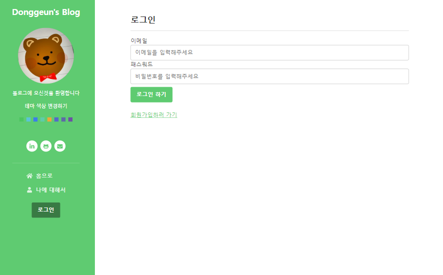 | 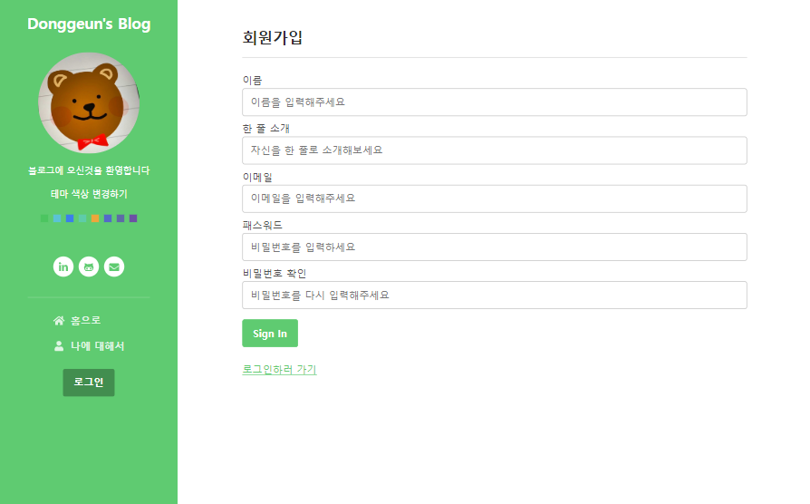 |
| :--------------------------------: | :-------------------------------------: |
|               로그인               |                회원가입                 |

| 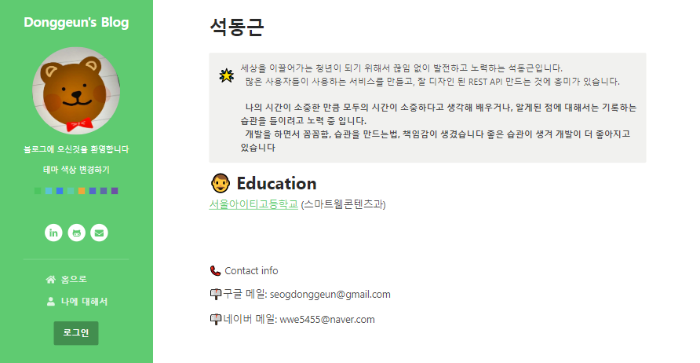 | 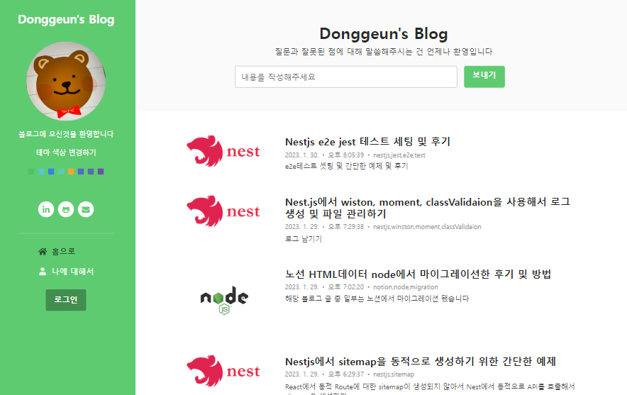 |
| :------------------------------------: | :-----------------------------: |
|                About me                |              Home               |

| 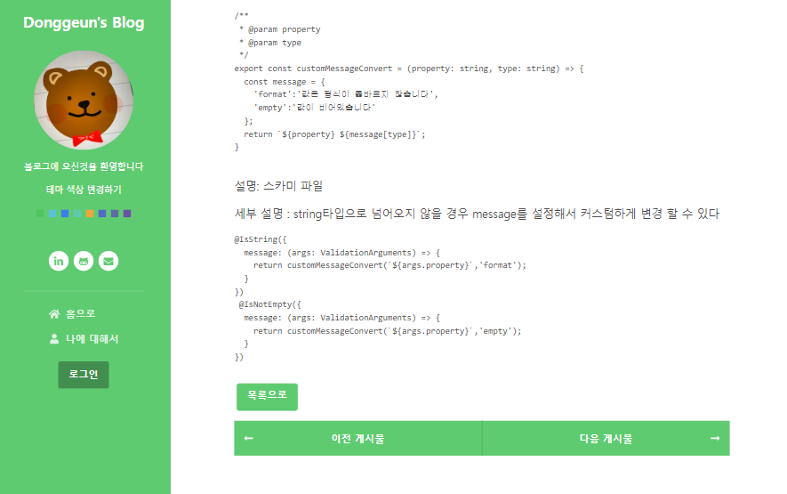 | 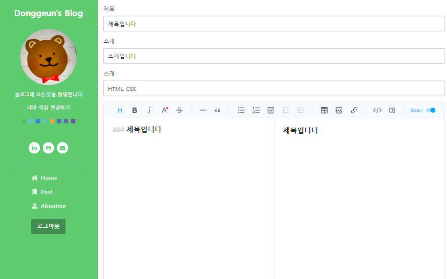 |
| :--------------------------------: | :---------------------------------: |
|              글 상세               |               글 작성               |

| 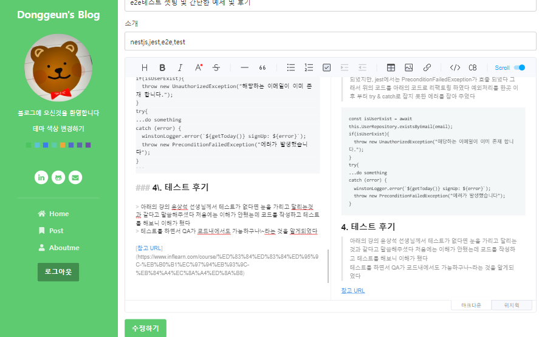 | 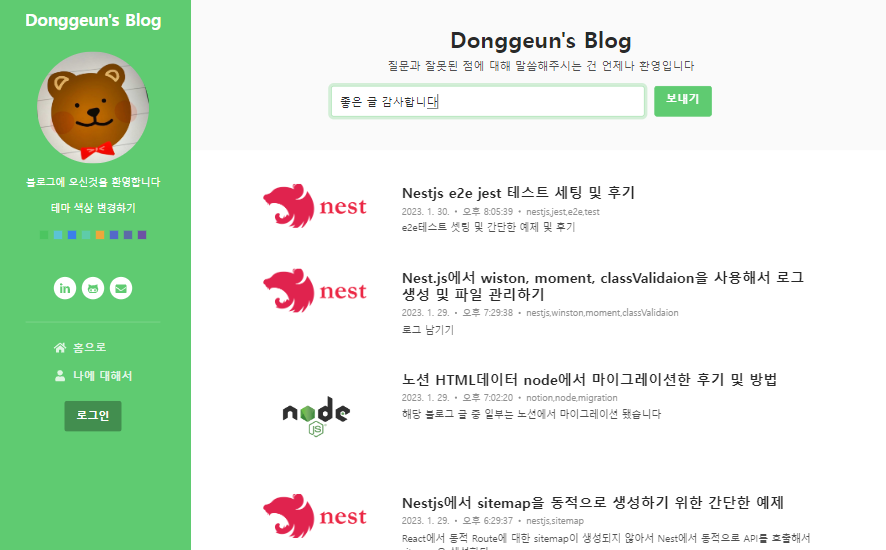 |
| :--------------------------------------: | :-------------------------------------------: |
|               글 업데이트                |                블로그 문의하기                |

| 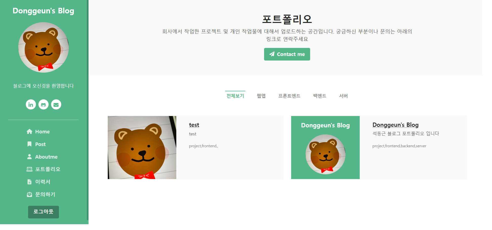 | 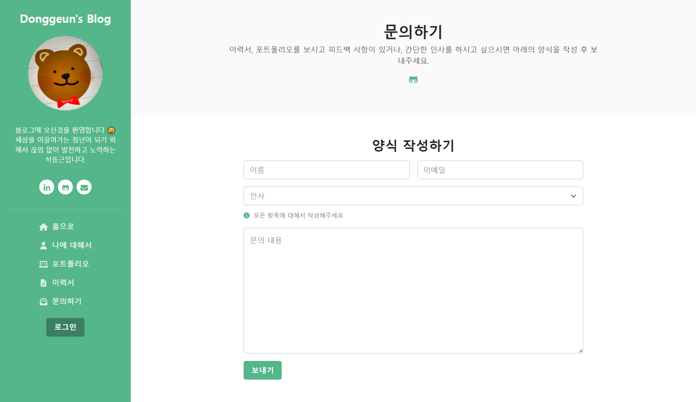 |
| :----------------------------------------: | :-------------------------------------------: |
|                 포트폴리오                 |                   문의하기                    |

| 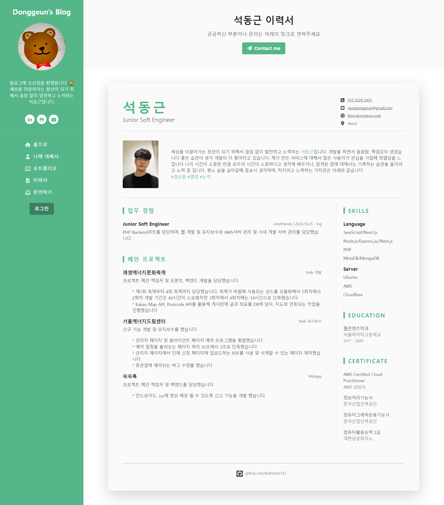 | 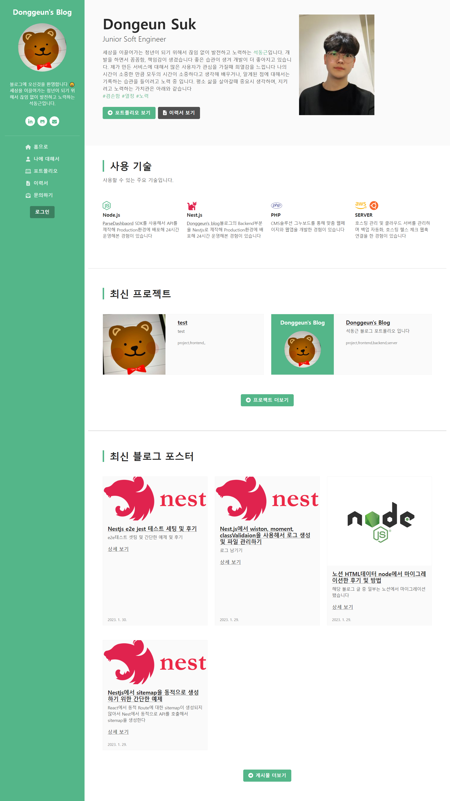 |
| :---------------------------------: | :---------------------------------------------------------: |
|               이력서                |                   업데이트된 나에 대해서                    |
