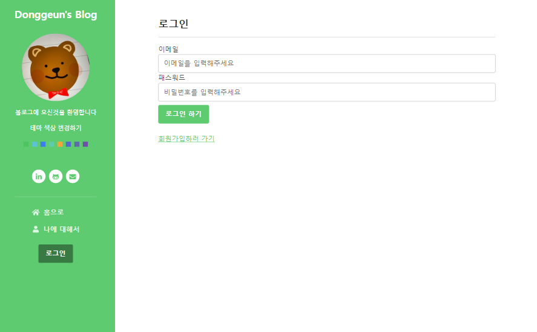
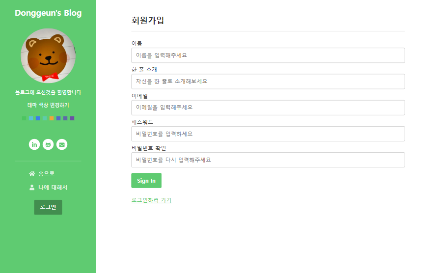
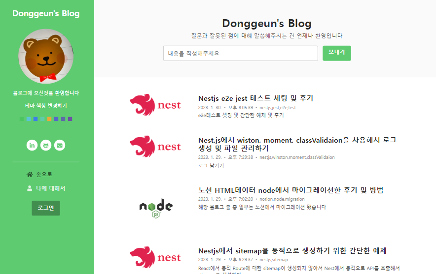
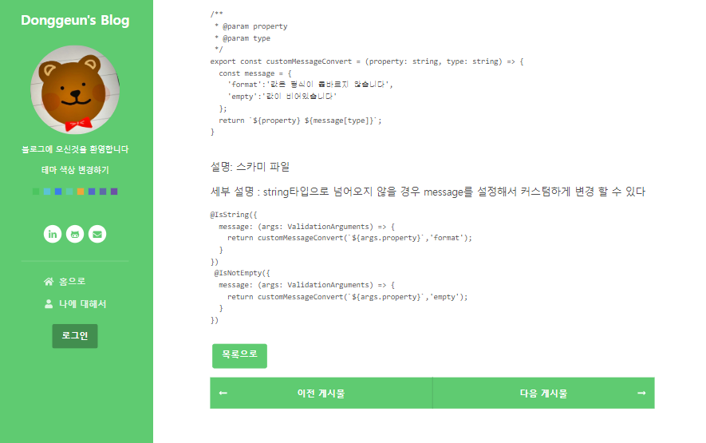
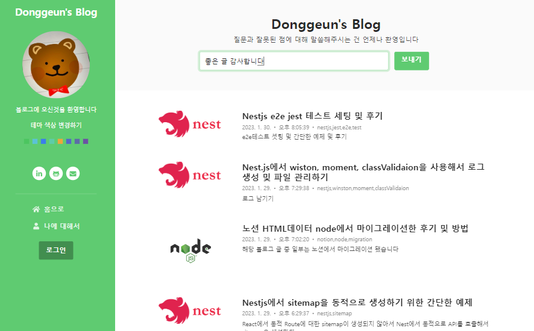

# donggeun's blog (2022.01.21 ~ ing)

동근이의 블로그
  
## [블로그 접속하기](https://blog.donggeun.co.kr)

  
# Git Repo
## [Frontend GIT](https://github.com/tjrehdrms123/blog-client)
## [Backend GIT](https://github.com/tjrehdrms123/blog-server)
## [Server GIT](https://github.com/tjrehdrms123/blog-cloudserver)
  

# 📖 목차 
 - [소개](#소개) 
 - [개발 환경](#개발-환경)
 - [사용 기술](#사용-기술)
 - [릴리즈 노트](#-Blog-릴리즈-노트)
 - [화면 구성](#화면-구성)

  
## 📃소개
**donggeun's blog**는 개인 블로그입니다
 
노션에 있는 데이터를 개인 블로그로 쓰고 싶어서 만들었습니다

## 개발 환경

 - Window 
 - Visual Studio Code
 - GitHub
 - DBeaver

## 사용 기술 

**웹서버**
 - Nginx

**백엔드**
 - NVM 
 - Node 16.18.0
 - Nest

**프론트엔드**
 -  React
 
**빌드 툴**
 - Webpack

**데이터베이스**
 - MongoDB

**인프라** 
 - AWS EC2
 - AWS RDS
 - Docker
 - Docker Compose

## 🛠 Blog 릴리즈 노트

 2023-01-22 MP v1.1.0 릴리즈 보기

   
  <h3>SEO 개선</h3>
  <ul>
    <li>react-helmet 적용</li>
    <li>동적 경로 sitemap 등록</li>
  </ul>
  <h3>버그 fix</h3>
  <ul>
    <li>쿼리스트링 없이 /home으로 접속했을때 꺠지는 이슈 수정</li>
  </ul>

 2022-01-29 MP v1.2.0 릴리즈 보기

       
  <h3>기능 fix</h3>
  <ul>
    <li>쿼리스트링 대신 react-router-dom 활용</li>
    <li>API 호출했을때 에러 및 예외 메세지가 정확히 오지 않는 부분 수정</li>
    <li>sitemap, rss 자동 업데이트 Shell Crontab등록</li>
  </ul>

  

## 💻화면 구성
||
| :-----------------------------------------------------------------------------------------------------------------: | :-----------------------------------------------------------------------------------------------------------------: | 
|로그인|회원가입

||
| :-----------------------------------------------------------------------------------------------------------------: | :-----------------------------------------------------------------------------------------------------------------: | 
|About me|Home

||
| :-----------------------------------------------------------------------------------------------------------------: | :-----------------------------------------------------------------------------------------------------------------: | 
|글 상세|글 작성

||
| :-----------------------------------------------------------------------------------------------------------------: | :-----------------------------------------------------------------------------------------------------------------: | 
|글 업데이트|문의하기